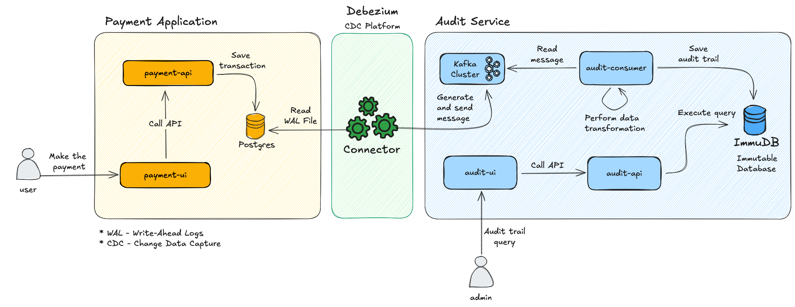
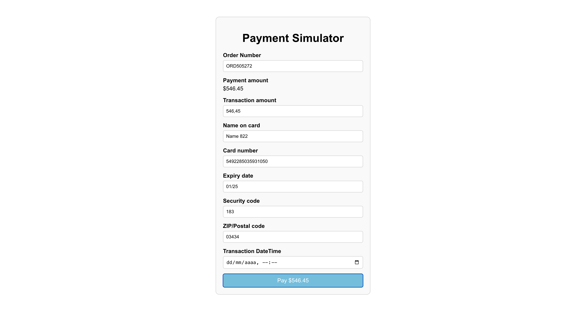
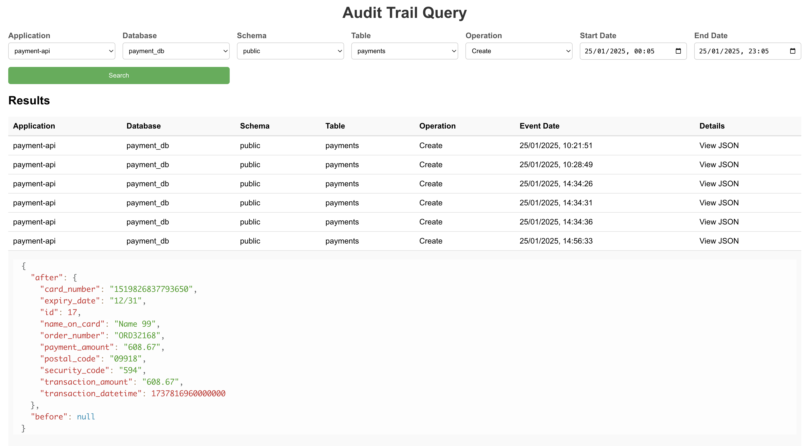

# Solução de Auditoria Baseada em CDC

   

O texto vem aqui

## Arquitetura



### Componentes


### Tecnnologias

## Instalação
A aplicação está configurada para ser executada com Docker Compose. Siga os passos logo abaixo, mas assegure-se de ter os pré-requisitos instalados:

**Pré-requisitos:**
- Go 1.21 ou superior
- Node 20.12 ou superior (para executar projeto localmente)

1. **Clona o repositório**

```bash
git clone https://github.com/Waelson/audit.git
cd audit
```

2. **Inicializa a stack**

```bash
docker-compose up --build
```

3. **Criar o conector**

4. **Acessa a aplicação**

## Interface de Usuário

### Simulador de Pagamentos



### Consulta de Trilhas de Auditoria



## 🧠 Teoria

### 💡CDC - Change Data Capture

___

#### O que é?

#### Quais problemas ela ajuda a resolver?